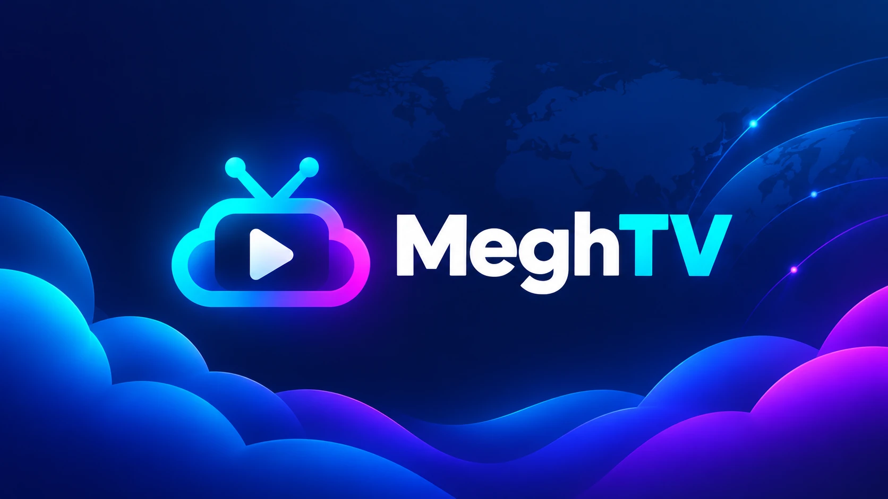

<p align="center">
  
</p>

# MeghTV


An Android TV and Android phone app for watching the live TV channels listed by [iptv-org](https://github.com/iptv-org). Channels are browsed by category or country, and favourites are stored on the device.

## Features

**Channels**
- Channel data (channels, categories, countries and stream URLs) comes from iptv-org. "Refresh Channels" downloads the latest data and updates the stored copy, keeping favourites for channels that are still listed. It also runs on first launch.
- The side panel has Refresh, Search, Favourites and Categories. Categories leads to All Channels, a single category, or Countries and then a country. Categories and countries without channels are not listed.
- Channel lists are sorted by name and show a channel count. An empty list shows a short message instead.
- Search matches channel names.
- The star next to a channel adds it to Favourites. The app opens on Favourites if there are any, otherwise on Categories.

**Playback**
- Supported stream formats: HLS, DASH, SmoothStreaming and RTSP.
- When a channel has several stream URLs and one fails, the next one is tried. If all fail, an error message with a Retry button is shown; it says whether the device is offline.
- On a phone, the CC button (captions) and the settings menu (audio track) are available when the stream has them.
- Playback stops when the app goes to the background and rejoins at the live position when it returns.

**TV remote**
- The arrow keys open the panel. It closes after 5 seconds without input, except while the search field is focused or a refresh is running.
- With the panel closed, OK shows the player controls, and OK again plays or pauses. The play/pause media key also works.
- Channel Up and Channel Down switch to the next or previous channel in the list the current channel was picked from.
- Back first hides the player controls, then opens the panel, then goes up one level.

**Phone**
- Landscape only, with the status bar hidden. The screen stays on during playback.
- The panel stays open until you tap outside it. The arrow on the right edge opens it again.
- A tap on the video shows the controls. With the controls showing, a tap plays or pauses. With the panel closed, a double tap plays or pauses.
- Volume and mute buttons are shown with the player controls.

List rows are only drawn while on screen, and no channel logos are downloaded.

## Tech stack

Kotlin, Jetpack Compose, Media3/ExoPlayer for playback, Room for local storage, OkHttp for fetching iptv-org's data.

## Building locally

Command-line only, no Android Studio required.

```bash
./gradlew assembleDebug     # debug build
./gradlew assembleRelease   # release build (R8 shrinking on, unsigned)
```

To build and sign a release APK the same way CI does, without needing to push anything:

```bash
scripts/build-local-release.sh
```

This needs the release keystore + its passwords available locally (kept outside the repo — never commit a keystore). See the script for how to point it at a different location if needed.

## Releasing

- All changes go through a PR — nothing gets pushed to `main` directly.
- Bump `versionName` (and `versionCode`) in `app/build.gradle.kts` as part of the PR when you want a new release to go out.
- On merge, [`.github/workflows/release.yml`](.github/workflows/release.yml) checks whether `versionName` actually increased since the last published release. If it did, it builds, signs, and publishes a new GitHub Release tagged by that version, with the signed APK attached. If it didn't, the merge is a no-op for releases — nothing gets rebuilt or republished.
