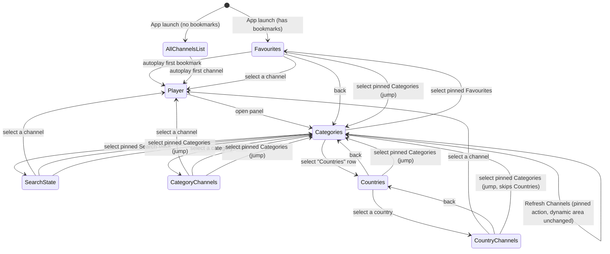

# Android TV Live-TV App — Feature List (v1)

Companion to [famelack-findings.md](famelack-findings.md). This is the scoped feature list for the app, based on your requirements + follow-up answers.

## Scope

- **TV channels only.** No Radio, no Webcam mode.
- **No 3D globe.** Browsing is panel/list based throughout.
- **Single device, no account/login.** Bookmarks and settings are stored locally on the device only (not synced across devices).

## Data source

- Source of truth: the **iptv-org GitHub repo** (channels, streams, categories, countries, languages) — legality of individual streams is not a concern for this project.
- On first launch, the app fetches and stores the dataset locally (so the app works without re-fetching every time).
- **Manual refresh only**, via a pinned **Refresh Channels** action at the very top of the panel (see Navigation below) — it's a one-shot action, not a navigable list.
- **No renaming.** Categories and channels are shown exactly as iptv-org names them — no curation, no relabeling.
- **List order = source order.** Categories and channels appear in the same order iptv-org's data provides them, unsorted — no alphabetizing, no re-ranking.

### Refresh mechanism

1. **Trigger** — selecting the pinned Refresh Channels action. One-shot, not a state you navigate into.
2. **Fetch** — pulls fresh `channels.csv`, `feeds.csv`, `categories.csv`, `countries.csv`, `languages.csv` from `iptv-org/database`, plus the compiled per-country playlists (`streams/<cc>.m3u`) from `iptv-org/iptv` for the actual URLs.
3. **Rebuild** — combines them into channel entries the same way as on first launch: one row per `channel@feed`, with its URLs collapsed into an ordered list (see "Multiple sources per channel" above).
4. **Diff against the current local dataset**, keyed by `channel@feed` (iptv-org's own stable id — not name or list position, since names can change and "source order" isn't itself a stable identity):
   - **Still present** → kept, with its display name/category updated to whatever the source says *now*. Bookmark status, Favourites position, and any manual Source pick all carry over, since they're stored against this same key.
   - **New** → inserted, appended in source order, not bookmarked.
   - **Gone from the source** → removed locally. If it was bookmarked, it's also dropped from Bookmarks, with the "N channels removed — no longer available" notice.
5. **Manual Source pick vs. changed URLs** — if a channel survives but its URL list changed, the app keeps pointing at the previously chosen URL if it's still present (even at a different position in the list); if that exact URL is gone, it silently resets to the first URL in the new list — treated the same as a normal automatic fallback, not an error.
6. **Doesn't touch live playback** — refresh only updates the stored dataset. Whatever's currently playing keeps playing uninterrupted, even if that exact channel gets removed mid-refresh — it just won't be there next time you browse to it.
7. **Failure handling** — if the fetch fails (offline, source unreachable, malformed data), the existing local dataset is left untouched and an error notice is shown. Never a partial or corrupted overwrite.
8. **Feedback** — a loading state on the Refresh Channels item while it runs, then a summary notice (e.g. "42 added, 17 removed, 3 bookmarks removed").

### Multiple sources per channel

Checked directly against iptv-org's data (`iptv-org/database`'s `channels.csv`/`feeds.csv`, and the compiled playlists in `iptv-org/iptv`) — a single channel can genuinely have more than one source, in two different ways, and they're handled differently:

1. **Multiple feeds of the same channel** — regional or quality variants (e.g. Australia's Channel 10 has 6 feeds: Sydney [main], Melbourne, Perth, Adelaide, Brisbane, Hobart). iptv-org already gives each feed its own distinguishing label.
   → **Each feed becomes its own row** in the channel list, labeled exactly as the source names it (per "no renaming" above).
2. **Multiple URLs for the exact same feed** — mirrors of the identical stream, common in the source data (e.g. `France24.fr@English` has 11 different URLs; this isn't rare — checked across several countries and it shows up constantly, since individual community-maintained links go stale, and quality/language between "identical" mirrors isn't always as identical as the label claims).
   → **Collapsed into a single row**, not shown as duplicate rows. All URLs for that feed are kept as an ordered list (source order) with two ways to move through it:
     - **Automatic**: if the current source fails to load or errors during playback, the app silently retries the next one — no interruption, no prompt.
     - **Manual**: a **Source** control in the player (see Playback below) lets you step through the same list on purpose — e.g. the current one works but is slow, or a "mirror" turns out to carry different audio. Your manual pick is remembered for that channel going forward, and becomes the new starting point for automatic fallback if it later fails.

## Default view & autoplay

- App launches directly into the **Bookmarks channel list**, with the **first channel in that list** — i.e. the most recently bookmarked one, see Favourites ordering below — auto-playing immediately. No extra step to start watching.
- **If there are no bookmarks**, the app instead opens the **All Channels** list (source order) with its first channel auto-playing.

## Navigation — pinned top actions + one dynamic panel

The panel has two parts, stacked vertically:

**Pinned top (always visible, never scrolls away, unaffected by everything below):**
1. **Refresh Channels** — a one-shot action (triggers sync), not a navigable list
2. **Search**
3. **Favourites**
4. **Categories** — jumps straight to the top-level categories list from anywhere, regardless of how deep the dynamic area currently is (e.g. from inside a country's channel list, this skips the intermediate country list entirely — unlike Back, which only pops one level at a time)

**Dynamic area below the pinned top** — this is the part that swaps content (slide transition). By default (and whenever pinned **Categories** is selected) it shows the **Categories list**: a flat, plain-text list (**no icons**) — All Channels, Countries, Top News, News, Music, Sports, Auto, Movies, Kids, ... — pulled from iptv-org's categories. **Countries** is one entry in this list; flags stay on country and channel rows, just not on the "Countries" row itself or any other category row.

Selecting anything — a category, Countries → a country, or the pinned Search/Favourites — replaces the dynamic area:
- The categories list (or whatever sibling list was showing) disappears.
- A header appears: **← [Name]** (back button + the name of what's open — a category, a country, "Favourites", or "Search").
- The matching channel list (or, for Countries, the intermediate country list) appears below that header.
- The four pinned items stay visible and interactive the whole time — only the dynamic area changes.

Two ways back to the categories list, both always available: **Back** pops one level at a time (a country's channel list → the Countries list → the Categories list); the pinned **Categories** item jumps straight to the top-level categories list in one step from wherever you are. The pinned top four are never affected by back navigation.

## UI wireframes

Full-bleed video always fills the screen; the single panel docks on the right. The pinned top 4 stay fixed; only the area below them swaps (D-pad focus stays inside the panel while browsing).

### A — Launch / Favourites open (default view)

```
┌──────────────────────────────────────────────────────┬───────────────────┐
│                                                        │ ⟳ Refresh Channels│
│                                                        │ 🔍 Search         │
│                                                        │ ★ Favourites      │
│                                                        │ ≡ Categories      │
│                                                        ├───────────────────┤
│                                                        │ ← Favourites      │
│                                                        │ [ Filter...     ] │
│              [ first bookmarked channel, autoplaying ] │▶🇬🇧 BBC News    ★│
│                                                        │ 🇺🇸 CNN          ★│
│                                                        │ 🇩🇪 DW           ★│
│                                                        │ ...               │
├────────────────────────────────────────────────────────────────────────────┤
│ ● LIVE   CC available          Now Playing: BBC News                        │
└────────────────────────────────────────────────────────────────────────────┘
```

### B — Categories list (idle state, nothing drilled in — also reached instantly via pinned "Categories")

```
┌──────────────────────────────────────────────────────┬───────────────────┐
│                                                        │ ⟳ Refresh Channels│
│                                                        │ 🔍 Search         │
│                                                        │ ★ Favourites      │
│                                                        │▶≡ Categories      │
│                                                        ├───────────────────┤
│                                                        │ All Channels      │
│                                                        │ Countries         │
│                                                        │ Top News          │
│              [ live video continues behind panel ]     │ News              │
│                                                        │ Music             │
│                                                        │ Sports            │
│                                                        │ Auto              │
│                                                        │ Movies            │
│                                                        │ ...               │
├────────────────────────────────────────────────────────────────────────────┤
│ ● LIVE   CC available          Now Playing: BBC News                        │
└────────────────────────────────────────────────────────────────────────────┘
```
Plain text rows, no icons.

### C — Category selected (e.g. "Sports")

```
┌──────────────────────────────────────────────────────┬───────────────────┐
│                                                        │ ⟳ Refresh Channels│
│                                                        │ 🔍 Search         │
│                                                        │ ★ Favourites      │
│                                                        │ ≡ Categories      │
│                                                        ├───────────────────┤
│                                                        │ ← Sports          │
│                                                        │ [ Filter...     ] │
│              [ selected channel now playing ]          │▶🇺🇸 ESPN        ☆│
│                                                        │ 🇬🇧 Sky Sports   ☆│
│                                                        │ 🇩🇪 Sport1       ☆│
│                                                        │ ...               │
├────────────────────────────────────────────────────────────────────────────┤
│ ● LIVE   CC available          Now Playing: ESPN                            │
└────────────────────────────────────────────────────────────────────────────┘
```
Every other category (News, Music, Auto, ...) is hidden while Sports is open — only the pinned top 4 remain, per your rule.

### D — Countries → a country (two-level drill, same pattern)

```
Countries selected                        Then a country selected
┌───────────────────┐                     ┌───────────────────┐
│ ⟳ Refresh Channels │                     │ ⟳ Refresh Channels │
│ 🔍 Search          │                     │ 🔍 Search          │
│ ★ Favourites       │                     │ ★ Favourites       │
│ ≡ Categories       │                     │ ≡ Categories       │
├───────────────────┤                     ├───────────────────┤
│ ← Countries        │   select a country  │ ← Germany          │
│ [ Filter...      ] │  ────────────────▶  │ [ Filter...      ] │
│▶🇦🇫 Afghanistan    │                     │▶🇩🇪 DW           ★│
│ 🇦🇱 Albania        │                     │ 🇩🇪 ARD          ☆│
│ 🇩🇪 Germany        │                     │ 🇩🇪 ZDF          ☆│
│ ...                │                     │ ...                │
└───────────────────┘                     └───────────────────┘
```
Back from the Germany channel list returns to the Countries list (not straight to Categories); back again returns to Categories. Pressing the pinned **Categories** item from either screen jumps straight to the top-level categories list in one step.

Each channel row: country flag, channel name, ★/☆ bookmark toggle (togglable in place). Selecting a row plays that channel immediately.

## Navigation flow



## Channel list — filtering

- In-list filter box (like the site's "Filter Channels..."), to narrow whichever list is currently open (Bookmarks, a category, a country, or search results) by typing.

## Playback

- Playback via **Media3/ExoPlayer** — native HLS support, adaptive bitrate.
- On-screen controls: Live badge, captions toggle (if the stream provides them).
- **Source control** — only shown when the current channel has more than one URL (see "Multiple sources per channel" above). Steps through the available sources one at a time (e.g. "Source 2 of 3"); the pick sticks for that channel, so you don't have to reselect it next time you tune in. Most channels have exactly one source, so this control is simply absent for them — nothing to think about in the common case.
- Bookmark toggle available from within the player too.
- Remote's hardware volume keys handle volume — no on-screen volume slider.

## Search

- **Search** is pinned at the top of the panel (with Refresh and Favourites), not buried in the categories list — searches by channel name across the entire dataset, not just the currently open list.
- Results behave like any other channel list (bookmark toggle, select to play).

## Performance & display targets

Two explicit constraints: stay smooth on **low-end hardware** (entry-level Fire TV Stick-class devices — often 1–1.5GB RAM, weak quad-core CPUs), and render cleanly on **4K displays**. These pull in different directions (lean enough to not choke weak hardware, crisp enough to not look blurry on a big 4K panel), so both need to be a constraint from the start, not a later pass:

- **Lists are lazy, never fully materialized.** Channel lists (especially "All Channels," which is every iptv-org channel) use `LazyColumn`, backed by paginated Room queries (Paging 3) — never load the whole dataset into memory or Composables at once, regardless of how many thousand channels exist.
- **No bitmap/image loading in v1.** Country indicators are flag *emoji* (text glyphs), not downloaded logo images — this sidesteps an entire class of low-end-device memory/jank problems (bitmap decoding, image cache eviction) that a channel-logo grid would introduce. If logos get added later, they'll need explicit downsampling + a bounded image cache — flagged here so it isn't forgotten if that request comes in.
- **Compose for TV, kept shallow.** Flat view hierarchies, stable data classes so recomposition scopes stay small, `derivedStateOf`/`remember` for anything computed from list state — standard Compose performance hygiene, called out explicitly because low-end TV CPUs punish careless recomposition much harder than a phone does.
- **Density-independent UI, not fixed pixels.** All layout in `dp`/`sp` through Compose so the same UI scales correctly from 720p low-end panels up through 4K — 4K support here means "crisp and correctly proportioned," not "a separate 4K layout." Vector-drawn UI (no raster chrome) scales natively without blur.
- **Video resolution follows the source, not a forced ceiling.** ExoPlayer's adaptive track selection is left to pick the appropriate HLS variant for the device/network rather than forcing max resolution — on a low-end device or constrained network it naturally steps down; on a strong connection it steps up to whatever the source actually offers (most iptv-org streams top out well under 4K regardless of the display).
- **Shrinking enabled for release builds.** R8/ProGuard on, to keep APK size and cold-start time down — matters more on low-end devices with slower storage.
- **Verification plan**: since the emulator setup gives us both ends of this range for free, testing happens on two AVD profiles — the `tv_1080p` device already created (representative of typical/low-end hardware) and a 4K-resolution profile added when UI work starts, to catch scaling issues early rather than at the end.

## Favourites — ordering

- **Newest bookmark first.** Adding a channel to Favourites puts it at the top of the list; the longer a channel has been bookmarked, the further down (and eventually to the bottom) it sits. This is what makes "first channel in the list" a stable, meaningful thing to auto-play on launch — it's always the most recently bookmarked channel.

## Explicitly out of scope for v1

- Radio mode, Webcam mode
- 3D globe / map visualization
- Random Channel shortcut
- Cloud sync / accounts / multi-device bookmarks
- EPG ("what's on now" program guide)

## Technical decisions

You left these to my judgment, so they're settled rather than left open:

- **Data mapping**: at refresh time, pull `channels.csv`, `feeds.csv`, `categories.csv`, `countries.csv`, and `languages.csv` from `iptv-org/database` for metadata, and the compiled per-country playlists (`streams/<cc>.m3u`) from `iptv-org/iptv` for the actual stream URLs; combine them locally by channel/feed id.
- **Local storage**: Room (SQLite) for the dataset + bookmarks — the data is inherently relational (channel → feed → URLs, channel → category, channel → country) and needs joined queries (e.g. "channels in category X", "is this channel bookmarked").
- **Category set**: iptv-org's `categories.csv` as-is, in source order, no curation (consistent with "no renaming" above).

---

## Implementation status

This was written before any code existed; the app now exists. Status as of the MeghTV rebrand (PR #1):

**Built and verified working** (on a local Android TV emulator, against real iptv-org data — a refresh pulled 10,986 real channels):
- Room data layer (channels/categories/countries/stream URLs/bookmarks), CSV/M3U parsers, the full refresh/diff mechanism described above
- Pinned-4 + single sliding panel navigation (Refresh/Search/Favourites/Categories → Countries → channel lists), matching the back-target rules above
- Real Media3/ExoPlayer HLS playback with automatic fallback across mirrored stream URLs on error
- Bookmarking, Favourites ordering, default-launch-into-Favourites-with-autoplay — confirmed persisting across app restarts
- MeghTV branding (icon, TV banner, app name)
- Local + CI build/sign/release pipeline (see `AGENTS.md` and `README.md` for how)

**Not yet built** (structurally supported by the data model, not wired into UI):
- Manual Source-switcher control in the player (data model + auto-fallback both already support multiple sources per channel)
- Search's live query-as-you-type hasn't been walked through end-to-end on-device
- Captions toggle
- Automated tests (none exist yet)
- `androidx.tv` (tv-foundation/tv-material) is a dependency but unused — the UI is plain Compose Foundation/Material3 with manual focus handling, a time-pressure simplification, not a final decision
- Paging 3 is a dependency but not wired into any query — "All Channels" (~11k rows) still loads as a plain `Flow<List<ChannelEntity>>`

See `AGENTS.md` for environment/tooling gotchas and exactly where things stand across open PRs.
